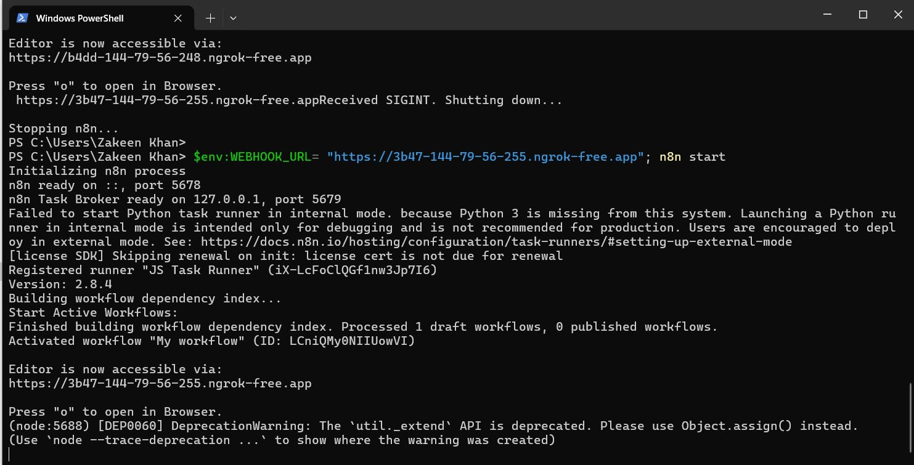
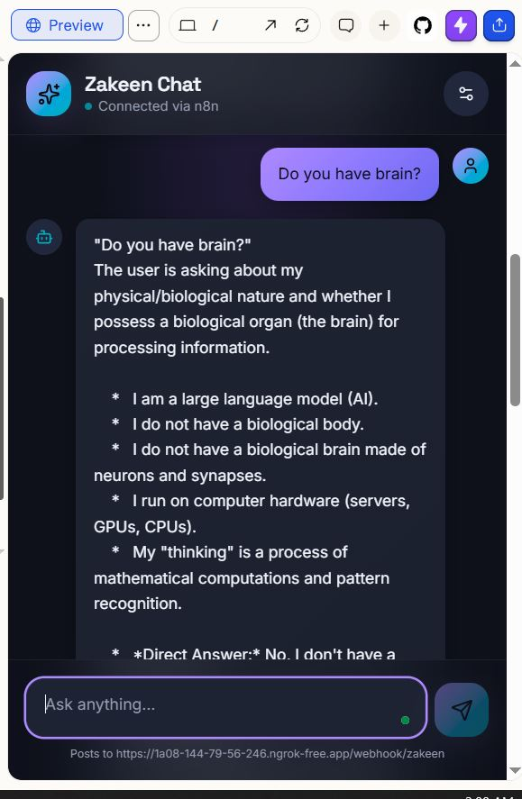
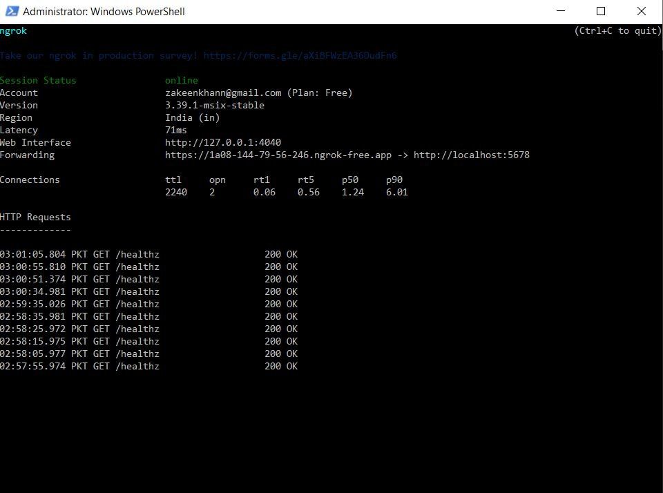
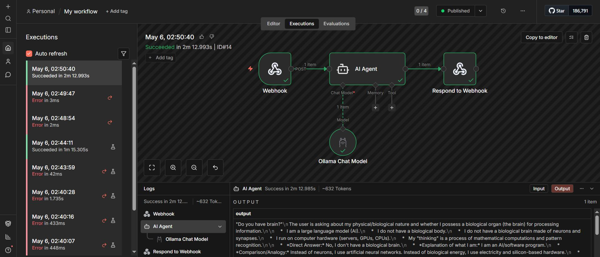
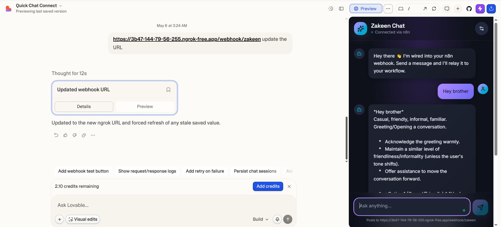

# 🚀 Self-Hosted LLM + n8n — 100% Local, Zero Paid APIs

A fully self-hosted AI chatbot pipeline running **n8n** (workflow automation) and **Ollama** (local LLM) entirely on your PC — no cloud APIs, no paid subscriptions. Connected to a live **Lovable** web app via **ngrok** for production-grade public access.

---

## 🏗️ Architecture

```
User (Browser / Lovable App)
        │
        ▼
   ngrok (Public URL → localhost:5678)
        │
        ▼
   n8n Webhook (POST /zakeen)
        │
        ▼
   AI Agent (n8n LangChain Node)
        │
        ▼
   Ollama Chat Model (gemma4:26b — LOCAL)
        │
        ▼
   Respond to Webhook → JSON back to User
```

**Flow:**
1. A user sends a chat message from the Lovable app (or any HTTP client).
2. The request hits the **ngrok** public URL, which tunnels to your local n8n instance.
3. n8n's **Webhook** node receives the POST request at `/zakeen`.
4. The **AI Agent** node passes the message to the **Ollama Chat Model** (`gemma4:26b`).
5. Ollama generates a response **locally on your GPU/CPU** — no external API calls.
6. The **Respond to Webhook** node sends the AI reply back as JSON.

---

## 📋 Step-by-Step Setup

### Step 1: Install Node.js & npm

n8n requires Node.js and npm. Install them first.

1. Download and install **Node.js** from [https://nodejs.org](https://nodejs.org) (LTS version recommended). npm is included with Node.js.
2. Verify the installation by opening **PowerShell** or **Command Prompt** and running:

```bash
npm -v
```

This should print the npm version number. If it does, Node.js and npm are installed correctly.

---

### Step 2: Install & Run n8n Locally

n8n is a free, open-source workflow automation tool. Running it locally gives you the **free forever** plan with full API access and no execution limits.

```bash
# Install n8n globally via npm
npm install -g n8n

# Start n8n from PowerShell / Command Prompt
n8n start
```

n8n will start on `http://localhost:5678`. Open it in your browser and complete the initial setup (create your owner account).


> **Why local?** The self-hosted version of n8n is **free forever** — no execution limits, no node limits, and you get a full API key for automation. You own your data completely.

---

### Step 3: Install Ollama & Download the LLM

[Ollama](https://ollama.com) lets you run large language models locally on your PC — no paid APIs needed. Follow the setup shown in the screenshot below.

1. Download and install **Ollama** from [https://ollama.com](https://ollama.com)
2. After installation, open a terminal and pull the model:

```bash
# Pull the Gemma 4 27B model
ollama pull gemma4:26b

# Verify the model is available
ollama list
```


> **Why local LLM?** Zero API costs, full privacy, works offline. The `gemma4:26b` model runs entirely on your hardware — no OpenAI, no Anthropic, no paid APIs.

---

### Step 4: Build the n8n Workflow

1. Open n8n at `http://localhost:5678`
2. Create a **New Workflow**
3. Add the following nodes:

| Node | Type | Configuration |
|------|------|--------------|
| **Webhook** | `n8n-nodes-base.webhook` | Method: `POST`, Path: `zakeen`, Response Mode: `Response Node`, Allowed Origins: `*` |
| **AI Agent** | `@n8n/n8n-nodes-langchain.agent` | Prompt: `{{ $json.body.message }}` |
| **Ollama Chat Model** | `@n8n/n8n-nodes-langchain.lmChatOllama` | Model: `gemma4:26b`, Credential: Ollama account |
| **Respond to Webhook** | `n8n-nodes-base.respondToWebhook` | (default) |

4. Connect them: **Webhook → AI Agent → Respond to Webhook**, and connect **Ollama Chat Model** to the AI Agent's language model input.
5. **Activate** the workflow (toggle the switch in the top-right).



The workflow JSON is available in [`Workflow.json`](Workflow.json) — you can import it directly into your n8n instance.

---

### Step 5: Test Locally

Send a test request to your local n8n webhook:

```bash
curl -X POST http://localhost:5678/webhook/zakeen \
  -H "Content-Type: application/json" \
  -d '{"message": "Hello, how are you?"}'
```

You should receive a JSON response from the local LLM.



---

### Step 6: Install ngrok & Set Up Environment Variable

To make your local n8n accessible from the internet (for the Lovable app or any external client), use **ngrok** — a free tunneling tool.

**6a. Download & Install ngrok**

1. Go to [https://ngrok.com](https://ngrok.com) and sign up for a free account.
2. Download ngrok for Windows.
3. After downloading, you need to add ngrok to your **system environment variable** so you can run it from any terminal:
   - Go to the folder where ngrok is installed and **copy the full path** (e.g., `C:\Users\YourName\Downloads\ngrok`).
   - Open **System Properties** → **Environment Variables** → under **System variables**, find `Path` → **Edit** → **New** → paste the ngrok folder path → **OK**.
4. Verify ngrok is installed globally by opening a **new** PowerShell or Command Prompt:

```bash
ngrok -v
```

This should print the ngrok version. If it does, ngrok is available system-wide.

**6b. Authenticate ngrok**

Go to your [ngrok dashboard](https://dashboard.ngrok.com/get-started/your-authtoken), copy your **authtoken**, and paste it in your terminal:

```bash
ngrok config add-authtoken YOUR_AUTH_TOKEN
```

This is a one-time setup — ngrok is now authenticated on your machine.

**6c. Start the ngrok Tunnel**

Open a **new terminal** and run:

```bash
ngrok http 5678
```

> ⚠️ **Important:** Check which port n8n is running on. By default it's `5678`, but if n8n started on a different port (e.g., `5679`), you must use that port instead: `ngrok http 5679`.

ngrok will display a **forwarding URL** like:

```
https://a957-144-79-56-247.ngrok-free.app → http://localhost:5678
```

Copy this URL — you'll need it in the next step.



**6d. Set the WEBHOOK_URL and Start n8n**

Open **another terminal** (keep the ngrok terminal running) and set the `WEBHOOK_URL` environment variable to your ngrok URL, then start n8n:

```powershell
# PowerShell
$env:WEBHOOK_URL="https://a957-144-79-56-247.ngrok-free.app"; n8n start
```

This tells n8n to use the ngrok public URL for webhook URLs instead of `localhost`, so external apps (like Lovable) can reach your workflows.

> ⚠️ **CRITICAL REMINDER — WEBHOOK_URL Changes Every Restart:**
>
> Every time you **turn off your PC** or **restart ngrok**, the ngrok URL changes (you get a new unique URL). When this happens:
> 1. Stop the current n8n workflow.
> 2. Start ngrok again: `ngrok http 5678` — copy the **new** forwarding URL.
> 3. Update the `WEBHOOK_URL` in your terminal:
>    ```powershell
>    $env:WEBHOOK_URL="https://YOUR-NEW-NGROK-URL.ngrok-free.app"; n8n start
>    ```
> 4. Update the webhook URL in your **n8n workflow** (Webhook node → update the test/production URL).
> 5. Update the API endpoint URL in your **Lovable app** to match the new ngrok URL.
>
> **Both n8n and Lovable must be updated with the new URL every time it changes.**

---

### Step 7: Connect to Lovable App for Live Production

[Lovable](https://lovable.dev) is an AI-powered web app builder. Connect it to your n8n webhook via the ngrok URL:

1. In your Lovable app, set the API endpoint to your ngrok URL:
   ```
   https://YOUR-NGROK-URL.ngrok-free.app/webhook/zakeen
   ```
2. Send POST requests with the user's message in the body:
   ```json
   { "message": "Your question here" }
   ```
3. The Lovable app receives the AI response and displays it in the chat UI.





> **How it works end-to-end:** User types in the Lovable app → request goes to ngrok URL → ngrok tunnels to your local n8n → n8n sends message to Ollama → Ollama generates response locally → response flows back through n8n → ngrok → Lovable app displays the answer.

---

## 💰 Cost Breakdown

| Component | Cost |
|-----------|------|
| n8n (self-hosted) | **Free forever** |
| Ollama + Gemma 4 27B | **Free** (runs on your hardware) |
| ngrok (free tier) | **Free** |
| Lovable | **Free tier available** |
| **Total** | **$0/month** |

---

## 📁 Project Files

```
Self-hosted-LLM_and_N8N/
├── Workflow.json              # n8n workflow (import this into your n8n)
├── Simple Run.JPG             # n8n running from PowerShell
├── Local LLM.JPG             # Ollama running locally
├── Olama models.JPG           # Available Ollama models
├── LiveRun.JPG                # n8n workflow active
├── ChattingApp.JPG            # Chat test via n8n
├── ngrok.JPG                  # ngrok tunnel setup
├── production.JPG             # Production deployment view
├── ChattingLovableAPP.JPG     # Live chat via Lovable app
└── README.md                  # This file
```

---

## 🔑 Key Takeaways

- **100% local** — n8n and the LLM run on your machine, no cloud dependency
- **Zero paid APIs** — Ollama replaces OpenAI/Anthropic/etc. entirely
- **Free forever n8n** — self-hosting removes all usage limits
- **Production-ready** — ngrok + Lovable gives you a live, public-facing AI chat app
- **Full privacy** — your data never leaves your machine (except through the ngrok tunnel when chatting)

